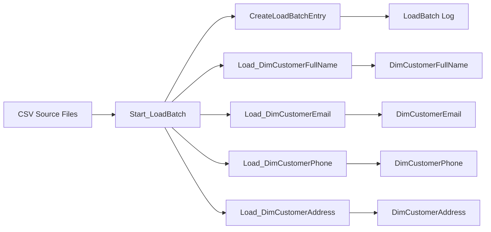

# Data Pipeline Portfolio

A small SQL Server ETL project that demonstrates how to load customer data from CSV files into a historical dimension model with audit logging and error tracking.

## Project Goal

This project shows how a batch-based data pipeline can:

- ingest customer records from CSV files
- normalize data into separate dimension tables
- track historical changes using SCD Type 2 patterns
- log every load batch and status update
- handle runtime errors gracefully

## What this project demonstrates

- **Normalized tables** - customer attributes are split into separate tables to reduce duplication and improve maintainability.
- **SCD Type 2** - historical versions of customer records are preserved when values change.
- **Load batch tracking** - every run is recorded in a log table for monitoring and auditing.
- **Error handling** - failed runs capture error messages and update the batch status.

## Architecture

## Data Model

The warehouse structure is built around a fact-like customer profile model split into multiple dimension tables:

- `LoadBatch` - stores the audit record for each data load operation
- `DimCustomerFullName` - tracks customer full name history over time
- `DimCustomerEmail` - tracks email changes history over time
- `DimCustomerPhone` - tracks phone number changes history over time
- `DimCustomerAddress` - tracks address changes history over time

Each dimension table uses:

- `CustomerId` as the business key
- `EffectiveLoadBatchId` to identify when the record became active
- `ExpirationLoadBatchId` to identify when it stopped being active
- surrogate key columns like `CustomerKey`, `EmailKey`, etc.

## File breakdown

1. [01 Database.sql](01%20Database.sql) - creates the `CustomerETL` database
2. [02 Tables.sql](02%20Tables.sql) - creates the dimension tables and batch log table
3. [03 StoredProcedure-CreateLogEntry.sql](03%20StoredProcedure-CreateLogEntry.sql) - inserts a new load batch record
4. [04 StoredProcedure-Parent-Start_LoadBatch.sql](04%20StoredProcedure-Parent-Start_LoadBatch.sql) - calls the child stored procedures that load data into their respective tables
5. [05 StoredProcedure-Child-Load_DimCustomerFullName.sql](05%20StoredProcedure-Child-Load_DimCustomerFullName.sql) - loads full name history
6. [05 StoredProcedure-Child-Load_DimCustomerEmail.sql](05%20StoredProcedure-Child-Load_DimCustomerEmail.sql) - loads email history
7. [05 StoredProcedure-Child-Load_DimCustomerPhone.sql](05%20StoredProcedure-Child-Load_DimCustomerPhone.sql) - loads phone history
8. [05 StoredProcedure-Child-Load_DimCustomerAddress.sql](05%20StoredProcedure-Child-Load_DimCustomerAddress.sql) - loads address history
9. [99 Testing.sql](99%20Testing.sql) - contains execution scenarios for normal and failure testing
10. [99 Monitoring.sql](99%20Monitoring.sql) - queries the current state of the batch log and dimension tables

## How to run the pipeline

Run the scripts in this order:

1. [01 Database.sql](01%20Database.sql)
2. [02 Tables.sql](02%20Tables.sql)
3. [03 StoredProcedure-CreateLogEntry.sql](03%20StoredProcedure-CreateLogEntry.sql)
4. [04 StoredProcedure-Parent-Start_LoadBatch.sql](04%20StoredProcedure-Parent-Start_LoadBatch.sql)
5. [05 StoredProcedure-Child-Load_DimCustomerFullName.sql](05&20StoredProcedure-Child-Load_DimCustomerFullName.sql)
6. [05 StoredProcedure-Child-Load_DimCustomerEmail.sql](05&20StoredProcedure-Child-Load_DimCustomerEmail.sql)
7. [05 StoredProcedure-Child-Load_DimCustomerPhone.sql](05&20StoredProcedure-Child-Load_DimCustomerPhone.sql)
8. [05 StoredProcedure-Child-Load_DimCustomerAddress.sql](05&20StoredProcedure-Child-Load_DimCustomerAddress.sql)
9. [99 Testing.sql](99%20Testing.sql) - Execute a batch using the test script
10. [99 Monitoring.sql](99%20Monitoring.sql) - Monitor the status

## Sample behavior

When a customer record changes, the old row is expired and a new row is inserted to preserve historical truth.

Example:

- Customer 1001 had a previous full name value
- a new CSV file contains an updated name
- the older version is marked with an `ExpirationLoadBatchId`
- the new version is inserted with a new `EffectiveLoadBatchId`

This is the typical pattern for SCD Type 2 dimension loading.

## Notes

This repository is designed as a learning and portfolio project for ETL orchestration, dimension loading, and SQL Server automation. It is intentionally simple, readable, and easy to extend.

---

### Quick summary

This project is a practical example of:

- ETL orchestration in SQL Server
- incremental historical tracking
- data quality/loading validation
- logging and monitoring for operational visibility